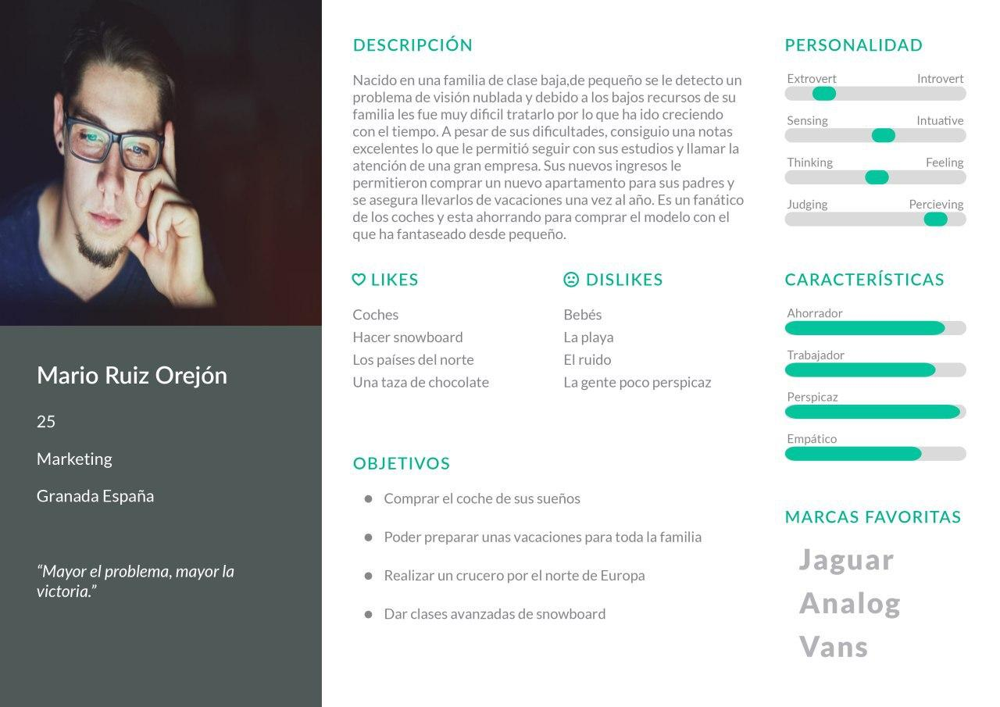
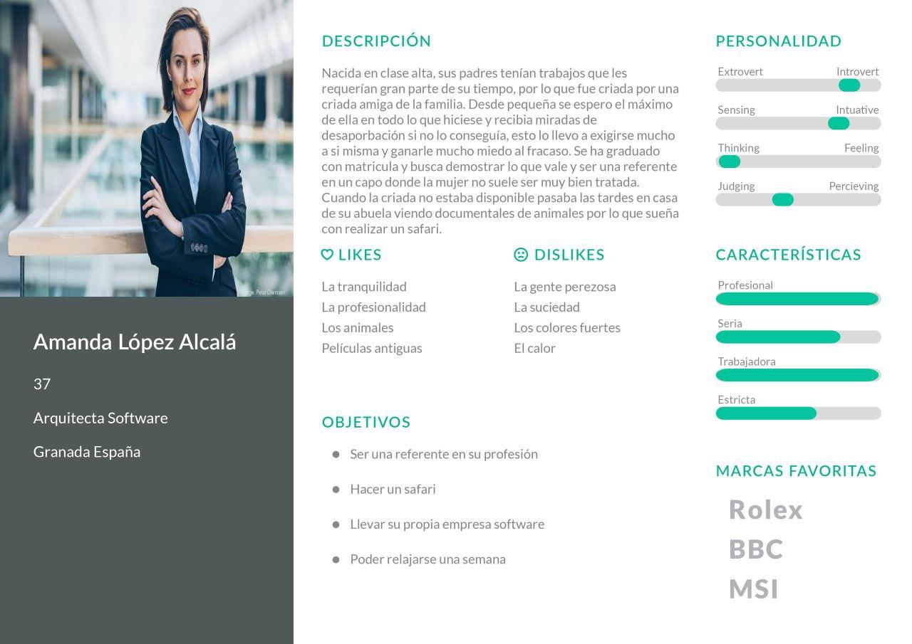
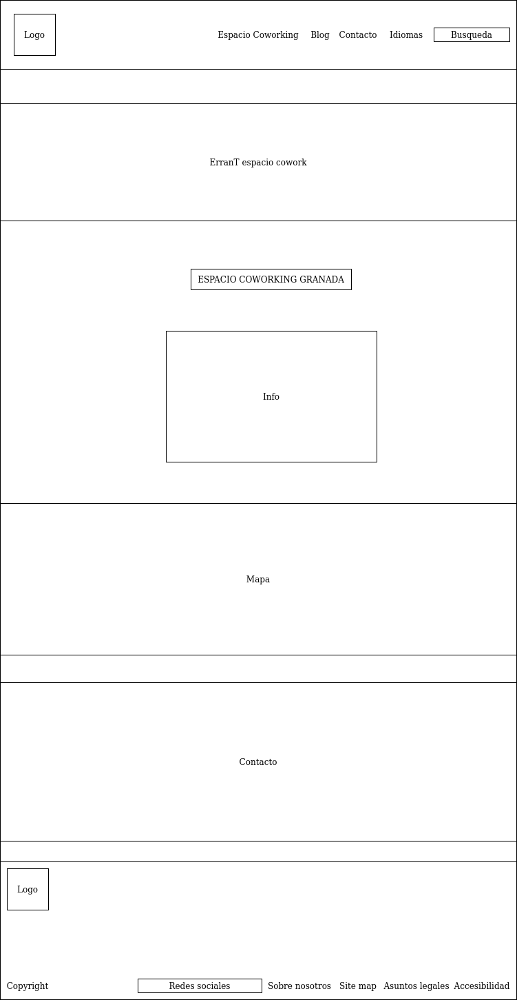
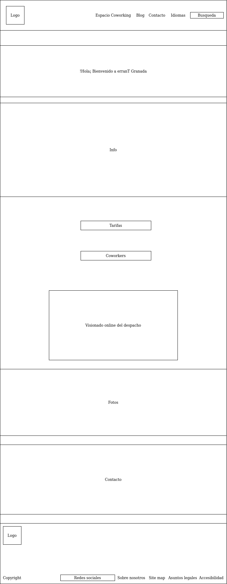
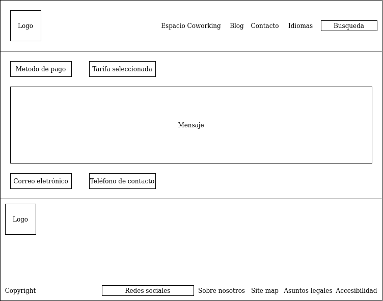

# DIU Trabajo Final

Trabajo final de la asignatura diseño de interfaces de usuario

# Realizado por Sergio Campos Megias

En este caso se nos pide realizar el rediseño de de la web de una empresa de
coworking. Las dos páginas que se nos sugieren son de dos empresas granadinas:
ErranT y Cubikate. Para entender bien el significado de coworking y saber que
empresa elegir, comenzaremos realizando una etapa de investigación y análisis.

## Primera Etapa. investigación y análisis UX

Empezaremos analizando el concepto de coworking para entenderlo algo mejor. Los
espacios de coworking son oficinas en las que varios profesionales de distintas
empresas se reúnen para realizar su trabajo, además de ellos existe la figura del
gestor, que trata de crear un ambiente de confianza y colaboración entre los
asistentes.

El objetivo del coworking es que distintos profesionales trabajen en un escenario
común, y puedan ayudarse unos a otros, compartiendo técnicas y manteniendo un
ambiente positivo y motivador entre los distintos participantes.

Ahora analizaremos las páginas ErranT y Cubikate:

-ErranT: La página es ordenada y presenta un buen diseño, en la parte superior
se encuentran las subpáginas, la búsquedas y un selector de idiomas. Además de eso
en la página principal se muestra los dos elementos principales que ofrece la empresa,
con pequeñas explicaciones de cada uno y enlaces a sus propias subpáginas. Por
último tenemos un mapa para saber donde encontrarlos y una forma de contacto
bastante completa y cómoda. Quizás a esta página principal le falta un pie con
algo de información extra como información legal, de accesibilidad, un mapa web...
Las subpáginas presentan más problemas, para empezar existen errores de php que
dan muy mala imagen. Además de eso hay bastante falta de cohesión en los diseños
de las subpáginas, presentado en algunos casos distinto layout y paleta de colores.
El sistema de búsqueda es bastante bueno y práctico.

-Cubikate: La estructura de la página es similar, en este caso tenemos las redes
sociales y números de contacto en la parte superior, el resto se parece mucho a
la anterior teniendo información sobre la compañía, un mapa con la ubicación y
un formulario de contacto. Algo destacable es que la página principal tiene
quizás demasiada información que puede ser innecesaria o quizás redundante,
aunque también es información que puede interesar a alguien que llegue de primeras a
la página por lo que su inclusión tampoco me parece muy errónea. Las subpáginas
son bastante estándar y no hay nada remarcable. Por último cabe destacar que la
página cuenta con un chat algo extraño que aparece como el icono de whatsapp en
la parte inferior derecha, esto puede ser confuso y poco claro y creo que no
es la forma más optima de realizarlo.

Tras estudiar las dos páginas se ha decidido que el rediseño se hará de ErranT
pues creo que es la página que más se puede beneficiar de las mejoras al tener
algunos errores fáciles de identificar y que podrían mejorar la calidad de la
página. Para lograrlo comenzaremos creando dos personas para que nos sirvan de
guía a la hora de identificar mejor los problemas y poder encontrar las
posibles soluciones.

####Persona 1: Mario Ruiz Orejón

En esto caso buscamos ejemplificar los problemas de accesibilidad que presenta
la página, tanto en ausencia de información, como problemas propios que pueden
aparecer.

####Persona 1: Amanda López Alcalá

Esta persona representa alguien extremadamente profesional que está interesado
en el coworking y que puede ser extremadamente quisquillosa con los problemas que
presenta la página.

###Escenarios

Para encontrar fallos de diseño de forma más sencilla, someteremos a nuestras
personas a una serie de escenarios:

####Escenario 1

*Persona:* Mario Ruiz Orejón

*Contexto:* A Mario siempre le ha gustado trabajar en compañía pues le ayuda a
relajarse y se siente más cómodo en esa clase de ambientes por lo que cuando tuvo que
cambiar de oficina y se encontró en una solitaria empeoró su rendimiento. Por
suerte un compañero le recomendó una empresa de coworking lo que le llevo a
ErranT.

*Escenario:* Mario entre en la página e inmediatamente busca si hay algo de
información de accesibilidad, sin embargo descubre que no hay nada en el pie
ni en el encabezado lo cual no le da muy buena impresión (¿Nadie se preocupa
por estas cosas? Se pregunta). Por suerte el método clásico de aumentar el
tamaño de la pantalla funciona bastante bien lo que le ayuda un poco. Por
desgracia incluso con el aumento no ve bien lo que se encuentra en la cabecera por
lo que decide usar una extensión de chrome que lee el contenido de la página, por
desgracia la voz comienza a leer el texto que hay en el centro de la página
saltándose completamente la cabecera. Además la voz no menciona nada sobre
redes sociales y no discierne nada en la parte inferior donde se encuentra
el formulario de contacto por lo que piensa que no tienen nada de información en
las redes cosa que le extraña mucho. Decide ir a la parte centra de la página
y clickar en la pestaña de espacio coworking granada. Esto lo lleva a otra
pestaña donde existen unas extrañas frases antes de la cabecera. Al usar la
extensión esta repite muchas veces una serie de avisos de peligro lo cual lo
asusta bastante y le hace pensar que quizás la página este detectando de alguna forma
sus extensiones y pensando que son algo dañino por lo que opta por no usarlas
y hacer lo que pueda. Encuentra un espacio que le permite ver la oficina
de forma virtual y con suficiente zoom para que su discapacidad no sea un
problema. Finalmente decide volver a la página principal y escribir un mensaje
para hacer preguntas en persona ya que la página le resulta incomoda.

*Conclusión:* Como vemos la página pone muchos impedimentos a las personas con
discapacidades y no parecen considerarlo para nada. No hay nada de información
de accesibilidad, muchos elementos están colocados en lugares poco intuitivos que
lo que puede ser muy problemático para mucha gente y el comportamiento con
extensiones que leen la página es muy malo. En el lado positivo el comportamiento
con el zoom estandar de página es bastante bueno.

####Escenario 2

*Persona:* Amanda López Alcalá

*Contexto:* El coworking siempre había generado rechazo en Amanda pues lo
consideraba una estupidez. Sin embargo cada vez le costaba más encontrar
gente con la que pasar tiempo fuera de trabajo por lo que acabo tragándose
el orgullo y buscando una página al respecto. Después de todo el trabajo es
lo más importante para ella asique porque no aprovecharlo para conocer gente
nueva.

*Escenario:* Amanda entra a la página y se sorprende porque inicialmente parece
bastante profesional. Comienza a leer tanto información sobre el coworking y
lee también la información de la pecera de comunicación pensando que está relacionado.
Cuando se da cuenta de que no es así desconfía un poco pues no entiende porque
hacer que la página trate de dos servicios tan dispares incluso si los ofrece la
misma empresa ("Si yo vendo zapatillas y doy clases particulares tendré una
página para cada cosa porque la gente que viene buscando zapatillas no le importa que
yo de clases" piensa). Luego observa el mapa y ve que le viene bastante bien de
distancia. Mira por encima el apartado de contacto para ver si tiene información de
redes sociales y se extraña al ver que no, pero al repasar un poco la página descubre
que se encuentran encima del mapa lo cual le extraña mucho pues no entiende el porque
de esa colocación. Decide ir a la subpágina de coworking y enseguida se enfada al
ver los errores de php que aparecen, que por poco le hacen cerrar la página al
instante. Decide calmarse y seguir explorando un poco, la vista online de la oficina
le gusta y decide buscar precios, no los encuentra inicialmente hasta que descubre
que se encuentra en una desplegable de la cabecera. Elige la tarifa que le interesa
y le da a reservar para descubrir que simplemente le lleva a la sección de contacto.
Después de reservar decide indagar un poco más sobre la página por curiosidad para
descubrir que carece de pie de página y de toda la información que debería contener,
lo cual le hace replantearse si ha sido buena idea reservar.

*Conclusión:* Como vemos, una persona minimamente exigente no dejará pasar los
claros errores que presenta la página y se verá molesto ante ellos. Además
detectará algunos problemas que cuya resolución es muy simple lo que
causará aún más rabia al no poder entender porque nadie se ha molestado en resolverlos.
En general una persona exigente pensará que la página tiene muy poco trabajo detras
y que no merece su tiempo. Por último puede ser extraño que la información sobre
la pecera de comunicación esté en la misma página siendo que no tiene nada que ver
con el coworking.

###Conclusión

Gracias a estos escenarios hemos podido discernir una serie de problemas:

-Ausencia de información de accesibilidad

-Problemas relacionados con la accesibilidad

-Problemas en la organización de la página

-Ausencia de pie de página y de información útil que suele incluir

-Fallos de php

-Inclusión innecesaria de la pecera de comunicación

A esto se le suman otros problemas más pequeños pero creo que estos son los más
clave. El tema en el que nos vamos a centrar más es en la accesibilidad por
lo que en el siguiente apartado haremos un estudio completo al respecto. Obviamente
no olvidaremos el resto de problemas y también se tendrán en cuenta a la hora de
diseñar unos nuevos wireframes.

## Segunda Etapa. Accesibilidad

Como hemos dicho, analizaremos la página con el objetivo de
hacerla lo más accesible posible, para ello hemos instalado distintas extensiones
de chrome que nos permiten simular varias discapacidades y analizar si la
página es adecuada para ellas. Pero primero trataremos el error más claro y es
la ausencia de información sobre accesibilidad. Para ello hemos pensado en añadir
un pie de página que incluya el logo, las redes sociales, site map, información legal y
la información de accesibilidad. Pinchando en esta última se nos llevara a una
página con información sobre el tema, se ha pensado que incluya una introducción
donde se expone que la página trata de ser lo más accesible posible para
toda clase de personas. A continuación expondrá que el usuario puede ampliar
el tamaño de texto si así lo desea usando control y + o -. Luego se nos expondrá
la estructura que sigue el sitio (Cabecera con menú, zona principal y pie) así como
un breve resumen de la información que contiene cada elemento. Se nos dará algo de
ayuda de navegación, atajos de teclado y por último se nos dirá si algún contenido
no ha podido adaptarse para ser accesible. Una vez aclarado este punto, analizaremos
la página aplicando una serie de discapacidades y apuntando los problemas
encontrados y posibles soluciones (las extensiones usadas son Web Disability Simulator y
Funkify–Disability Simulator).

###Visión borrosa

*Problemas:* Algunos iconos son muy pequeños y no se distinguen

*Solución:* Aumentar el tamaño, si representan algo que no se encuentra por
escrito como los iconos de redes sociales añadir el nombre de la red por escrito
cerca del icono

###Parkinson o temblores

*Problemas:* Algunos iconos son muy pequeños y difíciles de clikcar.

*Solución:* Este problema se ve ampliado porque algunos iconos tienen una imagen
grande, pero la zona clickable es solo el centro de la misma (como el icono de
búsqueda o el logo). Sería recomendable aumentar el tamaño de la zona a la que
puedes hacer click.

###Visión de tunel

*Problemas:* Algunos elementos están en zonas poco intuitivas y pueden ser
difíciles de encontrar.

*Solución:* Cambiar la colocación de estos elementos y comentarla en el apartado
de accesibilidad.

###Ceguera de colores

*Problemas:* Hay poco contraste entre algunos fondos y la letra

*Solución:* Usar tonos más oscuros.

Estos han sido los principales problemas encontrados, otras discapacidades no han
dado muchos problemas como cegueras de ciertos colores o déficit de atención.
Por las extensiones que leen la página para las personas que no pueden leerla por
si mismas no funcionan muy bien, por lo que deberíamos de asegurarnos que interaccionan
de forma correcta con el menú de la cabecera y el pie.

## Tercera Etapa. Wireframes

Teniendo en cuenta los fallos y problemas encontrados en las dos etapas anteriores
hemos re diseñado la página con una serie de wireframes que mostraremos a continuación:

En la página principal hemos eliminado toda la información sobre la pecera
comunicación para centrar el mensaje en el espacio de coworking, añadiremos
información sobre la pecera y el enlace a su página propia en el apartado
de sobre nosotros que hemos añadido en el pie. Otros cambios es agrandar el
apartado de búsqueda para que aparezca la zona donde escribimos sin necesidad de
darle a la lupa, lo que puede ayudar a personas con discapacidades al hacerlo más
visible y fácil de clickar. Por último y como hemos mencionado antes se ha añadido
un pie con información legal sobre la página, un sitemap, la información de accesibilidad
y la información sobre nosotros que hablará de la empresa en general y sus otro
proyectos (la pecera). Además hemos colocado los enlaces a redes sociales aquí.

Obviaremos los wireframes del la información legal sobre la página, sitemap,
accesibilidad  y información sobre nosotros pues no tienen nada destacable.

En esta página no hay muchos cambios, pero presentará accesos a las páginas sobre
tarifas y coworkers ya que tiene mucho sentido poder acceder a ellas a traves de
esta página y no solo desde el menú, eliminaremos el apartado de alquiler sala ya
que no es necesario y la información que contiene puede ir en esta página sin mucho
problema. Obviamente se eliminarían los errores de php.

La página de tarifas se mantiene igual, pero cambiando la parte de contacto que
actualmente presenta un rectángulo que casi parece representar un error por
el clásico formulario que presentan el resto de subpáginas. Además al pulsar reservar
se nos llevara a una página distinta de la de contacto con el siguiente formulario:

Esta página será un formulario de pago que nos permitirá elegir el método de pago,
cambiar la tarifa si lo deseamos, y nos pedirá introducir un correo y teléfono para
estar en contacto. Además habrá un espacio donde los usuarios podrán escribir cualquier
duda o consulta.

La página de coworkers no cambia mucho. Unicamente añadiremos el formulario de
contacto al final y cambiaremos un baner de color verde a rojo para mantener la
cohesión de la página.

La parte del blog presentará cambios similares, cambiando el fondo de la parte
donde se habla de que son ganadores de un premio por un tono más oscuro de
gris para aumentar el contraste. También añadiremos el formulario de contacto
al final.

La página de contacto se mantendrá igual.

## Conclusión

Ha sido muy interesante analizar una página ya existente e intentar mejorarla, sobre
todo con la libertad de elegir en que nos queremos enfocar más. En mi caso he decidido
dar mucha importancia a la accesibilidad a la vez que solucionaba errores básicos que
la página presentaba. Obviamente al tener poco tiempo se han dejado de lado muchas
técnicas optimas que se tendrían que utilizar en casos reales con tiempos extensos.
Pero en general creo que el resultado es bueno y una mejora al inicial.
